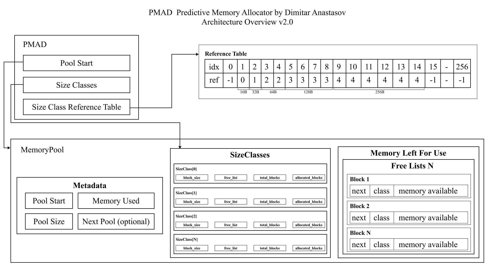

<p align="center">
  
</p>

<h1 align="center">PMAD — Predictive Memory Allocator by Dimitar Anastasov</h1>

<p align="center">
  <strong>A deterministic, O(1) slab allocator with a provable latency ceiling —<br/>
  for systems where the worst case matters more than the average.</strong>
</p>

<p align="center">
  <a href="#quick-start"></a>
  <a href="benchmarks/v2/REPORT.md"></a>
  
  <a href="LICENSE"></a>
  
  
</p>

---

## Contents

**[TL;DR](#tldr)** · **[Benchmarks](#benchmarks)** · **[When to use PMAD](#when-to-use-pmad--and-when-not-to)** · **[Architecture](#how-it-works)** · **[quicx integration](#real-world-integration-quicx)** <br/>
**[Quick start](#quick-start)** · **[Usage & API](#usage)** · **[Limitations](#limitations--honest-tradeoffs)** · **[Reproducibility](#reproducibility)** · **[Roadmap](#roadmap)**

---

## TL;DR

**PMAD** is a specialized memory allocator in C. It reserves one contiguous pool
via a single `mmap` at startup, splits it into user-defined **size classes**, and
serves every allocation as an **O(1)** free-list pop — **zero system calls at
runtime**, a fixed memory footprint, and **latency that is independent of block
size**. There is no slow path in the code, so the worst case is bounded by
construction.

It does **not** try to beat jemalloc/tcmalloc on raw average. It optimizes for
**worst-case determinism**, and the benchmarks below are head-to-head, on one
machine, and fully reproducible.

**At a glance** *(Apple M4 Pro, clang `-O3`, measured — see [REPORT.md](benchmarks/v2/REPORT.md)):*

- Hot-path latency **P50 2.59 ns / P99.9 6.50 ns** — the flattest body of any allocator tested
- **2.59 ns at every size from 16 B to 4096 B** — latency independent of block size
- Under sustained churn, PMAD's worst case stays at **~40 µs** while the system allocator blows out to **6.95 ms**
- Throughput **691 Mops/s** @ 64 B (small-object hot path)
- **19/19** correctness checks pass

> *Standard allocators optimize for average-case throughput. PMAD optimizes for
> predictable, bounded worst-case latency.*

---

## The headline: a flat latency curve

Per-operation latency on the hot path @ 64 B (block-amortised body, K=32; medians,
ns/op). The right-most column is the spread from median to three-nines — **lower is
flatter, flatter is more deterministic.**

| Allocator | mean | P50 | P99 | P99.9 | P99.9 / P50 |
|---|--:|--:|--:|--:|--:|
| **PMAD** | **2.31** | **2.59** | **3.91** | **6.50** | **2.5×** |
| tcmalloc | 3.83 | 3.91 | 6.50 | 7.81 | 2.0× |
| mimalloc | 3.32 | 2.62 | 5.19 | 9.09 | 3.5× |
| jemalloc | 7.69 | 7.81 | 16.91 | 144.53 | 18.5× |
| system (libmalloc) | 16.74 | 15.62 | 20.84 | 239.59 | 15.3× |

PMAD also has the **fewest slow operations** on the hot path — only **83 ppm** of
ops exceed 100 ns, ~20× fewer than the system allocator and ~9× fewer than jemalloc.

> **The point in one line:** under sustained 1024 B churn, the system allocator's
> worst case explodes to **6.95 ms** and mimalloc's to 73 µs — **PMAD stays at
> 40 µs**, because the slow path that produces those spikes does not exist in its
> code.

*Apple M4 Pro (8P+4E), macOS, clang `-O3 -march=native`, no LTO. jemalloc 5.3.0,
tcmalloc 2.18.1, mimalloc 3.3.2, system libmalloc — all measured head-to-head on
the same machine. Full methodology, raw data, and every table:*
**[benchmarks/v2/REPORT.md](benchmarks/v2/REPORT.md).**

---

## When to use PMAD — and when not to

| ✅ Reach for PMAD when | ❌ Look elsewhere when |
|---|---|
| Objects are **small & fixed-size**, ≤ 4096 B, sizes known ahead of time | You need a **general-purpose, multithreaded shared heap** (use jemalloc / mimalloc) |
| You need a **provable latency ceiling** (RTOS, HFT, frame budgets, packet pools) | Allocations are **large or variable** (> 4 KB, unbounded payloads) |
| Ownership is **single-threaded or shared-nothing per-core** | You **can't predeclare** your size classes |
| A fixed, capped memory footprint is acceptable — or desirable | You need runtime **double-free / use-after-free detection** |

PMAD is a *special-purpose* allocator and says so. Honest limitations are listed in
[their own section](#limitations--honest-tradeoffs).

---

## Benchmarks

Five workloads, each measured head-to-head against jemalloc, tcmalloc, mimalloc,
and the macOS system allocator. Summaries below; the full method (13 rigor
principles), per-rep spread, and committed raw samples are in
**[REPORT.md](benchmarks/v2/REPORT.md)**.

> On naming: macOS ships Apple's `libmalloc`, not glibc's `ptmalloc`. The harness
> is portable and calls plain `malloc`/`free` for the `system` backend, so it
> measures glibc when compiled on Linux. Below, the macOS system allocator is
> labelled `system`, **not** glibc.

### 1 · Tail-latency distribution (the headline)
The flat curve above. PMAD barely moves from P50 to P99.9 (2.5×) while jemalloc and
the system allocator fan out 15–18×; it also has the fewest ops ≥ 100 ns (83 ppm).
The extreme tail (`max`, ~30–50 µs) is OS-scheduling-bound and roughly equal for
*every* allocator — it is not an allocator discriminator on un-isolated macOS, and
we say so rather than claiming it.

### 2 · Latency by block size (the cleanest win)
PMAD's latency is **independent of block size** — the O(1) guarantee, demonstrated:

| Allocator | 16 B | 64 B | 256 B | 1024 B | 4096 B | *(P50 / P99.9, ns/op)* |
|---|--:|--:|--:|--:|--:|:--|
| **PMAD** | **2.59 / 6.50** | **2.59 / 6.50** | **2.59 / 6.50** | **2.59 / 5.19** | **2.59 / 6.50** | |
| tcmalloc | 3.91 / 7.81 | 3.91 / 7.81 | 3.91 / 13.03 | 3.91 / 7.81 | 3.91 / 29.94 | |
| mimalloc | 2.62 / 10.41 | 2.62 / 9.09 | 3.91 / 6.53 | 3.91 / 10.44 | 7.81 / 110.69 | |
| jemalloc | 7.81 / 52.06 | 7.81 / 144.53 | 7.81 / 143.22 | 7.81 / 154.94 | 9.09 / 15.62 | |
| system | 15.62 / 222.66 | 15.62 / 239.59 | 15.62 / 239.59 | 19.53 / 237.00 | 14.34 / 239.56 | |

PMAD's P50 is **2.59 ns at every size**; mimalloc's grows with size and its 4096 B
tail reaches 110 ns.

### 3 · Churn / fragmentation (the most important real-world test)
Random interleaved alloc/free against a **live working set of 262 144 objects**,
64 M operations per run — this is where general allocators fragment and their tails
degrade. Single-op tail @ 1024 B (fraction of ops over threshold; `max` in ns):

| Allocator | ≥ 100 ns | ≥ 1 µs | ≥ 10 µs | max |
|---|--:|--:|--:|--:|
| **PMAD** | **2.9 %** | 150.9 ppm | 5.9 ppm | **39 875 ns (40 µs)** |
| jemalloc | 0.1 % | 52.7 ppm | 2.2 ppm | 34 166 ns |
| tcmalloc | 1.6 % | 115.6 ppm | 3.7 ppm | 48 833 ns |
| mimalloc | 82 % | 572.4 ppm | 23.9 ppm | 73 375 ns |
| system | 95 % | 2208.7 ppm | 44.9 ppm | **6 950 250 ns (6.95 ms)** |

Per-window P99 across the full 64 M-op run (left = op 0 → right = op 64 M) — flat
lines mean no upward fragmentation drift:

```
PMAD      ▁▁▁▁▁▁▁▁▁▁▁▁▁▁▁▁▁▁▁▁▁▁▁▁▁▁▁▁▁▁▁▁▁▁▁▁▁▁▁▁▁▁▁▁▁▁▁▁▁▁▁▁▁▁▁▁▁▁▁▁  flat
jemalloc  ▁▁▁▁▁▁▁▁▁▁▁▁▁▁▁▁▁▁▁▁▁▁▁▁▁▁▁▁▁▁▁▁▁▁▁▁▁▁▁▁▁▁▁▁▁▁▁▁▁▁▁▁▁▁▁▁▁▁▁▁  flat
tcmalloc  ▁▁▁▁▁▁▁▁▁▁▁▁▁▁▁▁▁▁▁▁▁▁▁▁▁▁▁▁▁▁▁▁▁▁▁▁▁▁▁▁▁▁▁▁▁▁▁▁▁▁▁▁▁▁▁▁▁▁▁▁  flat
mimalloc  ▂▂▂▂▂▂▂▂▂▂▂▂▂▂▂▂▂▂▂▂▁▁▁▁▁▁▁▁▁▁▁▁▁▂▂▂▃▂▂▃▂▂▂▂▂▂▂▂▂▂▂▂▂▁▁▁▁▁▁▁  flat-ish
system    ▇▇▅▄▇▅▇▅▃▂▁▂▂▁▁▄▄▄▄▄▅▄▄▅▂▁▁▁▁▂▁▂▄▆▆▅▅▆▇▇█▂▁▁▁▁▁▁▃▇▆▇▇▇▇▇▆▄▁▁  volatile
```

**Read it honestly:** PMAD, jemalloc, and tcmalloc all stay flat and bounded;
**the system allocator and mimalloc fan out catastrophically** at 1024 B (95 % and
82 % of ops over 100 ns, millisecond and 73 µs worst cases). PMAD's worst case is
40 µs — 174× tighter than the system allocator. *Honest caveat:* at the smaller
64 B churn, jemalloc and tcmalloc actually have **fewer** ops ≥ 100 ns than PMAD —
their sharded thread caches have better cache locality than PMAD's single global
free list on a large random working set. PMAD's class is "top-tier determinism,
dramatically better than the system allocator and mimalloc, competitive with the
best on the extreme tail."

### 4 · Throughput (the secondary story)
Sustained operations/second, uninstrumented batch loop (Mops/s):

| Allocator | 16 B | 64 B | 256 B | 1024 B | 4096 B |
|---|--:|--:|--:|--:|--:|
| **PMAD** | **748.9** | **690.6** | 96.1 | 84.5 | 95.9 |
| mimalloc | 467.9 | 408.1 | 297.3 | 84.6 | 30.4 |
| tcmalloc | 267.8 | 211.8 | 111.7 | 93.8 | 37.5 |
| jemalloc | 133.6 | 125.9 | 119.1 | 94.3 | 48.1 |
| system | 134.9 | 124.0 | 95.8 | 38.9 | 19.7 |

PMAD wins decisively for small objects (16–64 B fit in cache → register-speed
free-list pops). **Honest weakness:** beyond ~256 B the working set spills out of
cache and PMAD's intrusive *global* free list has weaker spatial locality than
mimalloc's segment-local design — throughput drops to the ~85–96 Mops band.
Throughput is reported second on purpose; determinism is the story.

### 5 · Memory overhead by block size (choose your size)
PMAD keeps metadata **in-band** — a fixed 16-byte header per block. The cost is
**exact and predictable**, not statistical:

| Block size | 16 B | 32 B | 64 B | 128 B | 256 B | 512 B | 1024 B | 2048 B | 4096 B |
|---|--:|--:|--:|--:|--:|--:|--:|--:|--:|
| **Header overhead** | 50.0 % | 33.3 % | 20.0 % | 11.1 % | 5.88 % | 3.03 % | 1.54 % | 0.78 % | **0.39 %** |

The 16-byte header is significant for tiny objects (50 % at 16 B) and negligible
for medium/large ones (≤ 1.5 % at ≥ 1024 B). The malloc-family keep metadata
out-of-band, so their measured per-object RSS overhead is low for sizes that land
on a size class (0.1–2.5 % here) — but they round to fixed classes and you can't
predict the cost. **Second honesty point:** PMAD writes a header into every block
at init, so it **reserves and faults its entire pool upfront** — RSS equals the
configured pool from boot, regardless of utilisation. That fixed footprint is a
*feature* for hard real-time and a *cost* if you over-provision.

---

## Real-world integration: quicx

**[quicx](https://github.com/anastassow)** is a high-performance task-queue engine
in C (epoll/kqueue event loop, custom binary protocol, slab allocator, official
Java client), evolving toward a **shared-nothing multithreaded** dispatcher driven
by a reinforcement-learning scheduler. It's a clean fit for PMAD:

- **Shared-nothing per-core → one PMAD pool per worker, no locks needed.** PMAD's
  single-threaded design stops being a limitation and becomes the right shape.
- **User-configured message length maps directly to a PMAD size class** — PMAD is
  *built* around predeclared sizes, so the engine hands it exactly what it needs.
- **A bounded pool is natural backpressure:** exhaustion returns `NULL`, which a
  task queue must handle anyway — and the RL dispatcher can use **per-core pool
  occupancy as a routing signal**, steering away from cores near capacity.
- **Deterministic per-op latency → predictable queue SLAs.**

**Caveat, stated up front:** PMAD caps a block at 4096 B. For larger
user-configured payloads, raise `MAX_SIZE_OF_SIZE_CLASS` (cheap up to ~64 KB) or
pair PMAD-for-small-buffers with a fallback allocator for large payloads.

---

## How it works

The architecture diagram at the top of this README shows the full picture: the
static `PMAD` struct holds the O(1) lookup table and two pointers into a single
`mmap` pool, whose **front** holds the `MemoryPool` header and the `SizeClass[]`
metadata, with the block arena filling the rest.

**The layered call path** (top → bottom):

```
┌─────────────────────────────────────────────────────────┐
│                      User Program                       │
│         pmad_alloc(size)  /  pmad_free(ptr)              │
└────────────────────────┬────────────────────────────────┘
                         │
              ┌──────────▼──────────┐
              │   Public API Layer  │    incPMAD.h
              │  (Singleton facade) │    incPMAD.c
              └──────────┬──────────┘
                         │
              ┌──────────▼──────────┐
              │    PMAD Allocator   │    PMAD.h / PMAD.c
              │  Lookup Table → O(1)│
              │  Size Class → Free  │
              │    List pop/push    │
              └──────────┬──────────┘
                         │
              ┌──────────▼──────────┐
              │    Memory Pool      │    MemoryPool.h/.c
              │  mmap'd at init     │    BlockHeader.h/.c
              │  Split by % config  │    SizeClass.h
              └─────────────────────┘
```

1. **Initialization** — A single `mmap` reserves the pool, which is split into size
   classes by your percentages and sizes (fully configurable).
2. **Allocation** — A lookup table maps the requested size to a class index in
   O(1); a block is popped from that class's free list.
3. **Deallocation** — The block header identifies its size class; the block is
   pushed back onto the free list.
4. **Destruction** — A single `munmap` releases all memory at once.

> **Alloc** = lookup-table index + free-list pop. **Free** = header read + free-list
> push. That is the *entire* worst case — there is no slow path to audit. For the
> full deep-dive see [`Documentation_v1.0.pdf`](Documentation_v1.0.pdf).

---

## Quick start

### Prerequisites

| Requirement | Minimum |
|---|---|
| **C Compiler** | GCC or Clang with C99 support |
| **OS** | Linux or macOS (POSIX `mmap`) |
| **Build Tool** | GNU Make |

### Build, test, run

```bash
git clone https://github.com/anastassow/PMAD.git
cd PMAD

make            # build the demo
./main          # run it
```

### Reproduce the benchmarks (correctness first)

```bash
cd benchmarks/v2
make && make test          # build + correctness suite — 19/19 must pass first
./run_all.sh               # full head-to-head suite -> raw/
python3 aggregate.py       # raw/ -> results/tables.md
```

Competitor allocators (jemalloc, tcmalloc/gperftools, mimalloc) are auto-detected;
missing ones are skipped. See [REPORT.md](benchmarks/v2/REPORT.md) for the exact
versions and environment.

---

## Usage

```c
#include "incPMAD.h"

int main(void) {
    /* Size classes and each class's share of the pool (%). Shares must sum to 100. */
    size_t classes[]     = { 16, 32, 64, 128, 256 };
    size_t percentages[] = { 10, 20, 20, 20, 30 };

    /* One mmap; zero further syscalls. Returns a PmadStatus. */
    if (pmad_init(classes, 5, percentages, 1024 * 1024) != PMAD_OK)
        return 1;

    int* data = pmad_alloc(sizeof(int) * 4);   /* O(1); NULL if class exhausted */
    if (!data) { pmad_destroy(); return 1; }

    for (int i = 0; i < 4; i++)
        data[i] = i * 10;

    pmad_free(data);     /* O(1) */
    pmad_destroy();      /* single munmap */
    return 0;
}
```

### API reference

| Function | Returns | Description |
|---|---|---|
| `pmad_init(class_sizes, num_classes, percentages, pool_size)` | `PmadStatus` | Initialize with custom size classes + pool shares (must sum to 100). One `mmap`. |
| `pmad_alloc(size)` | `void*` | Allocate ≥ `size` bytes — O(1). Returns `NULL` on exhaustion or `size > 4096`. |
| `pmad_free(ptr)` | `PmadStatus` | Return a block to its free list — O(1). |
| `pmad_destroy()` | `void` | Release the whole pool back to the OS (single `munmap`). |
| `pmad_get_stats(out, max_classes)` | `int` | Fill `PmadClassStats[]` (block size, total/allocated blocks); returns count. |

**`PmadStatus`:** `PMAD_OK`, `PMAD_ERR_INIT_FAILED`, `PMAD_ERR_MAP_FAILED`,
`PMAD_ERR_INCOMPLETE_PERCENTAGE`, `PMAD_ERR_NULL_PTR`, `PMAD_ERR_INVALID_PTR`,
`PMAD_ERR_CORRUPT_HEADER`, `PMAD_ERR_OOM`.

**Limits:** alignment 16 B; max block size 4096 B (`MAX_SIZE_OF_SIZE_CLASS`); up to
32 size classes (`MAX_PMAD_CLASSES`).

---

## Fully customizable — designed around your workload

Unlike jemalloc (fixed classes), tcmalloc (fixed bands), or ptmalloc (dynamic
bins), PMAD lets you define **exactly which sizes exist** and **how much memory
each gets** — then computes every block count exactly before a line of application
code runs. Everything is set at initialization: size classes, per-class pool
share, total pool size.

The included [interactive infographics dashboard](allocator_info_graphics/allocator_infographics.html)
has a **Live Pool Configurator** — adjust size classes, percentages, and pool size
and watch block counts, usable bytes, and per-class utilisation update instantly.
Every number is mathematically exact, computed before any code runs.

> Example configuration recipes (size classes + split) for common domains —
> *tune to your own workload; verify with `benchmarks/v2`:*

| Profile | Size classes (B) | Split (%) | Target |
|---|---|---|---|
| Max throughput | `{16}` | `100` | Small-object velocity |
| Min overhead | `{4096}` | `100` | Bulk data density |
| Balanced | `{64, 256, 1024}` | `{60, 30, 10}` | Mixed workloads |
| Latency-optimised | `{32, 128}` | `{80, 20}` | Critical signaling |
| HFT / network | `{32, 128, 512, …}` | `{60, 20, …}` | L3 packet processing |
| Embedded / RTOS | `{8, 16, 32, …}` | `{30, 30, …}` | Deterministic control |

---

## Design principles

- **Single allocation, no statistical fragmentation** — the whole pool is reserved
  upfront via one `mmap`. No runtime heap growth; metadata overhead is exact and
  predictable (see Bench 5), not a statistical unknown.
- **O(1) guaranteed** — both alloc and free are a lookup-table index and a
  free-list pop/push. No fallback paths, no locking, no slow path.
- **User-defined memory layout** — size classes and pool shares are fully
  configurable for known workload profiles.
- **Minimal, predictable metadata** — a single 16-byte `BlockHeader` (next pointer
  + class ID) per block.
- **No external dependencies** — pure C99 with POSIX `mmap`.

---

## Limitations & honest tradeoffs

PMAD is a special-purpose allocator. These are real constraints, not footnotes:

- **Single-threaded** — one global free list, no locks. Safe only per-thread or in
  a shared-nothing per-core design. *(Roadmap: per-thread pools.)*
- **Max block 4096 B** (`MAX_SIZE_OF_SIZE_CLASS`) — larger blocks need a recompile
  or a fallback allocator.
- **No double-free / use-after-free detection** — there is no per-block free bit, so
  a second `pmad_free` returns `PMAD_OK` and corrupts the free list. Documented in
  the test suite rather than hidden.
- **Reserves & faults the whole pool upfront** — RSS equals the configured pool from
  boot, regardless of utilisation (a feature for hard real-time, a cost if over-provisioned).
- **Throughput cliff beyond cache** — for large-block batches the global free list's
  spatial locality is weaker than sharded thread-cache allocators (Bench 4).
- **Not the most deterministic under small-block churn** — jemalloc and tcmalloc
  edge PMAD on ≥ 100 ns op count at 64 B (Bench 3).

---

## Reproducibility

Every number in this README is reproducible. The benchmark harness is **one source
compiled once per allocator** (so swapping allocators changes exactly one
variable); raw samples are committed under
[`benchmarks/v2/raw/`](benchmarks/v2/raw/), and every table derives from them via
`aggregate.py`. The full 13-principle methodology — timer-resolution probing,
instrument-cost subtraction, optimizer defeat, warmup/pre-faulting, single-op vs
block-amortised timing, and the platform caveats — is documented in
**[REPORT.md](benchmarks/v2/REPORT.md)**.

```bash
cd benchmarks/v2 && make && make test && ./run_all.sh && python3 aggregate.py
```

---

## Repository structure

```
PMAD/
├── include/                    # Public & internal headers
│   ├── PMAD.h                  #   Core struct & API; ALIGNMENT, MAX_SIZE_OF_SIZE_CLASS
│   ├── incPMAD.h               #   Public singleton API + PmadClassStats
│   └── structures/             #   BlockHeader.h, MemoryPool.h, SizeClass.h
│
├── src/                        # Implementation
│   ├── PMAD.c                  #   init, alloc, free, lookup table, pool split
│   ├── incPMAD.c               #   singleton wrapper — public API
│   ├── MemoryPool.c            #   pool attachment
│   ├── BlockHeader.c           #   block creation & free-list insertion
│   └── SIzeClass.c             #   (reserved for size-class utilities)
│
├── benchmarks/
│   └── v2/                     # ← current head-to-head suite (use this)
│       ├── bench.c             #     one harness, compiled once per allocator
│       ├── pmad_test.c         #     correctness suite (run first)
│       ├── pmad_mem.c          #     exact metadata overhead
│       ├── run_all.sh          #     orchestration -> raw/
│       ├── aggregate.py        #     raw/ -> results/tables.md
│       ├── raw/                #     committed raw samples (every number traces here)
│       ├── results/            #     generated tables + overhead CSV
│       └── REPORT.md           #     full methodology + results
│
├── allocator_info_graphics/    # Interactive dashboard + Live Pool Configurator
├── docs/images/                # Architecture diagrams
├── main.c                      # Example / demo entry point
├── Makefile                    # Build system
├── Documentation_v1.0.pdf      # Full technical documentation
└── LICENSE                     # MIT
```

---

## Roadmap

- [ ] **Thread safety via per-thread / per-core pools** — enables shared-nothing
      engines like quicx without locks
- [ ] **Blocks larger than 4 KB** — bucket-indexed size→class lookup
- [ ] **Debug build with double-free / use-after-free detection**
- [ ] Dynamic pool expansion (additional `mmap` pools on demand)
- [ ] Per-class custom alignment; statistics & monitoring API
- [ ] Integration examples for embedded RTOS (FreeRTOS, Zephyr)

---

## Contributing

Contributions are welcome.

1. **Fork** and create a feature branch.
2. **Follow the existing style** — K&R braces, 4-space indentation, descriptive names, C99.
3. **Add benchmarks** for performance-sensitive changes (use `benchmarks/v2`).
4. **Update documentation** if the public API changes.
5. Submit a **pull request** with a clear description.

Header guards with `#ifndef`/`#define`/`#endif`; struct typedefs in
`include/structures/`; public API via `incPMAD.h`, internals via `PMAD.h`.

---

## Documentation & license

Full technical documentation: [`Documentation_v1.0.pdf`](Documentation_v1.0.pdf)
(architecture & design rationale, allocator comparison, development stages,
complexity analysis). Benchmark methodology and head-to-head results:
[`benchmarks/v2/REPORT.md`](benchmarks/v2/REPORT.md). Interactive dashboard:
[`allocator_info_graphics/allocator_infographics.html`](allocator_info_graphics/allocator_infographics.html).

Licensed under the **MIT License** — see [LICENSE](LICENSE).

---

<p align="center">
  <sub>Built by <a href="https://github.com/anastassow">Dimitar Anastasov</a> · 2026</sub>
</p>
