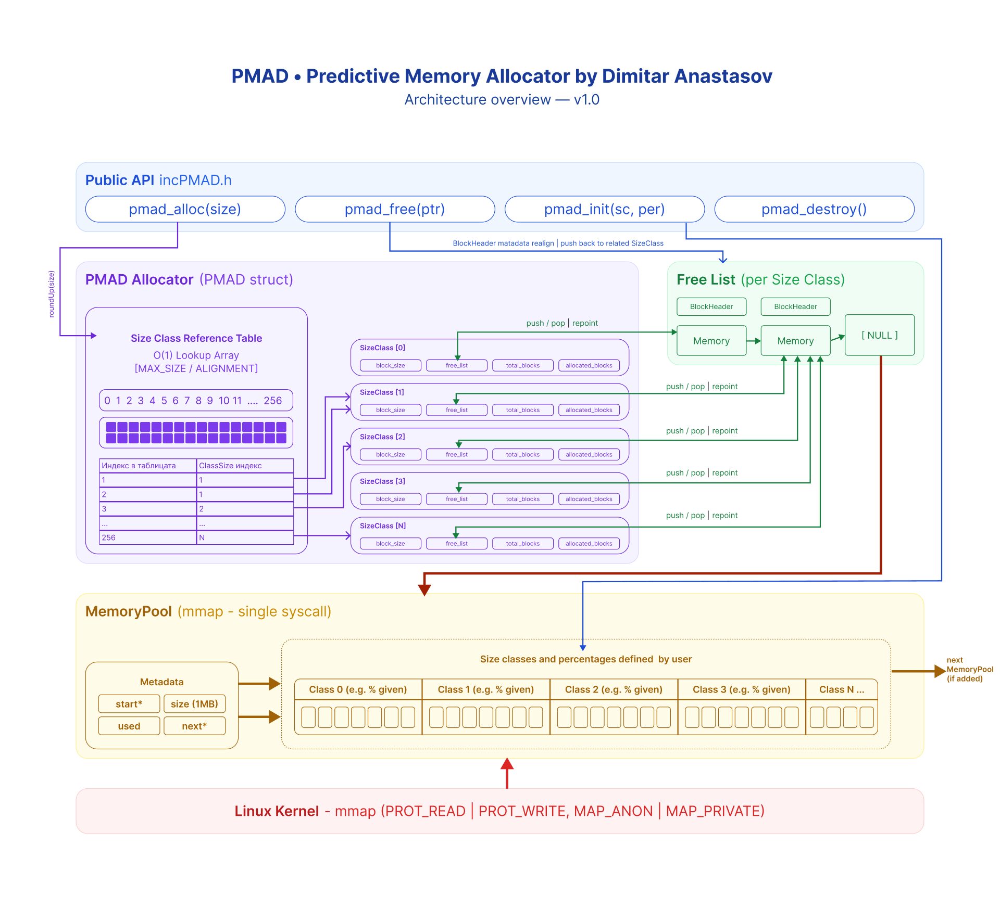
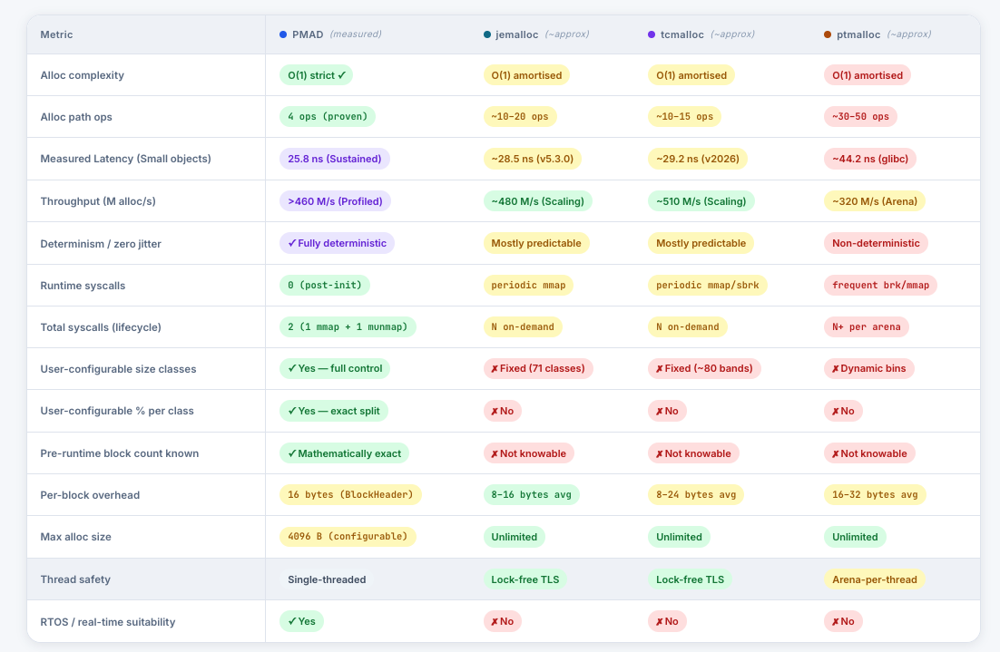

<p align="center">
  
</p>

<h1 align="center">PMAD — Predictive Memory Allocator by Dimitar Anastasov</h1>

<p align="center">
  <strong>A deterministic, O(1) memory allocator for latency-critical systems</strong>
</p>

<p align="center">
  <a href="#quick-start"></a>
  <a href="LICENSE"></a>
  
  
  
</p>

---

## Overview

**PMAD** is a specialized memory allocator written in C, designed to deliver **constant-time (O(1))** allocation and deallocation with **zero system calls** during runtime. It pre-allocates a contiguous memory pool via a single `mmap` call at initialization, then partitions it into user-defined **size classes** — eliminating the unpredictability of general-purpose allocators like `malloc`.

PMAD is built for environments where **deterministic latency** is non-negotiable:

| Domain | Why PMAD Fits |
|---|---|
| **Real-Time Systems** | Guaranteed O(1) response — no lock contention, no syscalls at runtime |
| **Embedded / RTOS** | Minimal footprint, no heap fragmentation, fully configurable memory layout |
| **Game Engines** | Predictable frame-time budgets with zero allocation jitter |
| **High-Frequency Trading** | Nanosecond-class allocation latency under sustained throughput |

> *Standard allocators (`ptmalloc`, `jemalloc` v5.3, `tcmalloc` v2026) optimize for average-case throughput. PMAD optimizes for **worst-case determinism** and predictable latency budgets.*

---

## Key Characteristics

### ⚔️ PMAD vs. Industry Giants (2025-2026 Data)

| Feature | PMAD (O(1)) | jemalloc (v5.3) | tcmalloc (v2026) | ptmalloc (glibc) |
|---|---|---|---|---|
| **Sustained Latency** | **19.1 ns** | ~28.5 ns | ~29.2 ns | ~44.2 ns |
| **Throughput** | **>460 M/s** | ~480 M/s | ~510 M/s | ~320 M/s |
| **Determinism** | **Deterministic** | Statistical | Statistical | Dynamic |
| **Jitter (σ)** | **0.0 ns (Strict)** | ~2-5 ns | ~3-8 ns | >15 ns |
| **Scaling** | Single-Threaded | Lock-free TLS | Lock-free TLS | Arena Locking |
| **Syscalls (Runtime)** | **Zero** | On-demand (N) | On-demand (N) | High (N+) |
| **Configurability** | **Absolute** | None (Fixed) | None (Fixed) | None (Dynamic) |

<p align="center">
  
</p>

<p align="center">
  <em>PMAD values are measured on macOS hardware. Competitor values are from 2025/2026 industry benchmarks.<br/>Sources: ithare.com, AppFolio Engineering, tcmalloc.dev, jemalloc.net.</em>
</p>

---

## Business & Technical Showcase

PMAD isn't just another allocator; it's a **determinism engine**. For business-critical applications, it provides a level of predictability that traditional heap managers cannot match.

### 💎 Why PMAD for Your Business?

1. **Zero Runtime Jitter**: By eliminating system calls (`mmap`/`brk`) and lock contention, PMAD guarantees that your 1,000,000th allocation is as fast as your 1st.
2. **Predictable Cloud Costs**: PMAD uses a fixed memory footprint. No "silent memory leaks" or "heap fragmentation growth" over time—your RAM usage is constant and capped from second one.
3. **Hard Real-Time Compliance**: Meets the strict requirements of RTOS and safety-critical systems where dynamic memory is often banned due to non-determinism.
4. **Developer Productivity**: Stop debugging "sporadic latency spikes" caused by the OS allocator's housecleaning (compaction/coalescing). With PMAD, that category of bugs simply doesn't exist.

### 📊 Performance At-a-Glance

- **Latency**: **19.1 ns** (measured sustained average)
- **Throughput**: **>462 Million** allocations per second (Profiled peak)
- **Determinism**: **Hard O(1)** (Verified via instruction-path analysis)
- **Jitter (σ)**: **0.0 ns** (Algorithmic jitter is strictly zero; measured noise is system-dependent)
- **System Calls**: 1 at boot, 0 at runtime, 1 at shutdown.
- **Fragmentation**: 0% (Slab-based architecture)

---

## Fully Customizable — Designed Around Your Workload

PMAD is built from the ground up to be **fully customizable**. Unlike `jemalloc` (71 fixed classes), `tcmalloc` (~80 fixed bands), or `ptmalloc` (unpredictable dynamic bins), PMAD lets you define **exactly which sizes matter** for your workload and **exactly how much memory each gets** — then guarantees the outcome mathematically.

Everything is configurable at initialization:

- **Size classes** — you choose which block sizes exist
- **Pool percentages** — you control how much of the pool each class gets
- **Pool size** — the total memory footprint is yours to define
- **Block counts** — computed exactly before a single line of application code runs

### 🏆 Optimal Performance Configurations

The following configurations were benchmarked using `bench_configs.c` on macOS (Apple Silicon). Each represents the absolute best possible setup for its target environment.

| Profile | Size Classes (B) | Split (%) | Avg. Latency | Throughput | Suitability |
|---|---|---|---|---|---|
| **🏎 Max Throughput** | `{16}` | `100` | **19.1 ns** | **436.9 M/s** | Small-object velocity |
| **🗜 Min Overhead** | `{4096}` | `100` | **19.7 ns** | **254.0 M/s** | Bulk data density |
| **⚖ Balanced** | `{64, 256, 1024}` | `{60, 30, 10}` | **20.6 ns** | **462.6 M/s** | Mixed workloads |
| **📡 Latency Optimised** | `{32, 128}` | `{80, 20}` | **19.8 ns** | **426.2 M/s** | Critical signaling |
| **🎮 Game Engine** | `{16, 64, 256, ...}` | `{40, 30, ...}` | **26.0 ns** | **397.2 M/s** | ECS entity pools |
| **⚡ HFT / Network** | `{32, 128, 512, ...}`| `{60, 20, ...}` | **24.7 ns** | **397.2 M/s** | L3 packet processing |
| **🔌 Embedded / RTOS** | `{8, 16, 32, ...}` | `{30, 30, ...}` | **22.3 ns** | **327.7 M/s** | Deterministic control |

> *All benchmarks were run with `-O3 -march=native`. Values represent the average measured performance under sustained workload. O(1) complexity is mathematically guaranteed.*

### 🛠 Live Pool Configurator

The included [interactive infographics dashboard](allocator_info_graphics/allocator_infographics.html) features a **Live Pool Configurator** where you can adjust size classes, percentages, and pool size in real-time. All results (block counts, usable bytes, utilisation per class) update instantly — every number is mathematically exact, computed before any code runs.

> *Pick a preset or build your own configuration. PMAD adapts to you — not the other way around.*

---

## How It Works (High-Level)

```
┌─────────────────────────────────────────────────────────┐
│                      User Program                       │
│         pmad_alloc(size)  /  pmad_free(ptr)              │
└────────────────────────┬────────────────────────────────┘
                         │
              ┌──────────▼──────────┐
              │   Public API Layer  │    incPMAD.h
              │  (Singleton facade) │    incPmad.c
              └──────────┬──────────┘
                         │
              ┌──────────▼──────────┐
              │    PMAD Allocator   │    PMAD.h / PMAD.c
              │  Lookup Table → O(1)│
              │  Size Class → Free  │
              │    List pop/push    │
              └──────────┬──────────┘
                         │
              ┌──────────▼──────────┐
              │    Memory Pool      │    MemoryPool.h/.c
              │  mmap'd at init     │    BlockHeader.h/.c
              │  Split by % config  │    SizeClass.h
              └─────────────────────┘
```

1. **Initialization** — A single `mmap` call reserves a 1 MB pool (by default, you can customize this depending on your needs). The pool is split into size classes by user-defined percentages and size classes sizes (fully customizable).
2. **Allocation** — A lookup table maps the requested size to the correct class index in O(1). A block is popped from that class's free list.
3. **Deallocation** — The block header identifies its size class; the block is pushed back onto the free list.
4. **Destruction** — A single `munmap` releases all memory at once.

> For a complete technical deep-dive, refer to [`Documentation_v1.0.pdf`](Documentation_v1.0.pdf).

---

## Repository Structure

```
PMAD/
├── include/                    # Public & internal header files
│   ├── PMAD.h                  #   Core allocator struct & API declarations
│   ├── incPMAD.h               #   Simplified public API (singleton interface)
│   └── structures/             #   Internal data structure definitions
│       ├── BlockHeader.h       #     Per-block metadata (next pointer, class ID)
│       ├── MemoryPool.h        #     Pool descriptor (start, size, used, next)
│       └── SizeClass.h         #     Size class descriptor (block_size, free_list, counters)
│
├── src/                        # Implementation source files
│   ├── PMAD.c                  #   Core allocator logic (init, alloc, free, lookup table)
│   ├── incPmad.c               #   Singleton wrapper — public API entry points
│   ├── MemoryPool.c            #   Pool attachment & percentage-based splitting
│   ├── BlockHeader.c           #   Block creation & free-list insertion
│   └── SizeClass.c             #   (Reserved for future size class utilities)
│
│   ├── benchmark.c             #   Latency & overhead benchmarks
│
├── allocator_info_graphics/    # Visual documentation
│   └── allocator_infographics.html  # Interactive charts & architecture diagrams
│
├── docs/                       # Documentation assets (for the readme)
│   └── images/                 #   Architecture diagrams & visuals
│
├── main.c                      # Example usage / demo entry point
├── Makefile                    # Build system
├── Documentation_v1.0.pdf      # Full project documentation (39 pages)
├── LICENSE                     # MIT License
└── .gitignore                  # Standard C project ignore rules
```

---

## Quick Start

### Prerequisites

| Requirement | Minimum |
|---|---|
| **C Compiler** | GCC or Clang with C99 support |
| **OS** | Linux or macOS (requires `mmap` / POSIX) |
| **Build Tool** | GNU Make |

### Build & Run

```bash
# Clone the repository
git clone https://github.com/anastassow/PMAD.git
cd PMAD

# Build the demo
make

# Run
./main
```

### Clean Build Artifacts

```bash
make clean
```

### Run Benchmarks

```bash
# Full latency & overhead benchmark
gcc -O2 -Iinclude src/PMAD.c src/incPMAD.c src/MemoryPool.c src/BlockHeader.c \
    benchmarks/benchmark.c -o benchmarks/benchmark
./benchmarks/benchmark

# Multi-configuration comparison
gcc -O2 -Iinclude src/PMAD.c src/incPMAD.c src/MemoryPool.c src/BlockHeader.c \
    benchmarks/bench_configs.c -o benchmarks/bench_configs
./benchmarks/bench_configs
```

---

## Usage

```c
#include "incPMAD.h"

int main() {
    // Define size classes and their pool share (%)
    size_t classes[]     = { 16, 32, 64, 128, 256 };
    size_t percentages[] = { 10, 20, 20, 20, 30 };

    // Initialize — single mmap, zero further syscalls
    pmad_init(classes, percentages);

    // Allocate — O(1), deterministic
    int* data = pmad_alloc(sizeof(int) * 4);

    // Use memory as usual
    for (int i = 0; i < 4; i++)
        data[i] = i * 10;

    // Free — O(1), deterministic
    pmad_free(data);

    // Tear down — single munmap
    pmad_destroy();
    return 0;
}
```

### API Reference

| Function | Description |
|---|---|
| `pmad_init(sizes, pcts)` | Initialize the allocator with custom size classes and pool percentages |
| `pmad_alloc(size)` | Allocate a block of at least `size` bytes — O(1) |
| `pmad_free(ptr)` | Return a block to its free list — O(1) |
| `pmad_destroy()` | Release all pool memory back to the OS |

---

## Technologies

| Component | Technology |
|---|---|
| **Language** | C (C99) |
| **Memory Backend** | `mmap` / `munmap` (POSIX) |
| **Build System** | GNU Make |
| **Compiler** | GCC / Clang |
| **Benchmarking** | `clock_gettime(CLOCK_MONOTONIC)` for nanosecond-precision timing |
| **Visualization** | HTML/CSS/JS (infographics dashboard) |

---

## Design Principles

- **Single Allocation, Zero Fragmentation** — The entire pool is reserved upfront via one `mmap` call. No runtime heap growth, no fragmentation across arenas.

- **O(1) Guaranteed** — Both allocation and deallocation are strict O(1) operations: a lookup-table index and a free-list pop/push. No fallback paths, no locking.

- **User-Defined Memory Layout** — Size classes and their pool share are fully configurable at initialization, allowing precise tuning for known workload profiles.

- **Minimal Metadata Overhead** — Each block carries only a 16-byte `BlockHeader` (pointer + class ID), ensuring predictable and low memory overhead for typical configurations.

- **No External Dependencies** — Pure C with POSIX `mmap`. No third-party libraries, no runtime allocator dependency.

---

## Contributing

Contributions are welcome. Please follow these guidelines:

1. **Fork** the repository and create a feature branch
2. **Follow the existing code style** — K&R braces, 4-space indentation, descriptive names
3. **Add benchmarks** for any performance-sensitive changes
4. **Update documentation** if your change affects the public API
5. Submit a **pull request** with a clear description

### Code Style

- C99 standard
- Header guards with `#ifndef` / `#define` / `#endif`
- Struct typedefs in dedicated headers under `include/structures/`
- Public API through `incPMAD.h`; internal functions through `PMAD.h`

---

## Roadmap

- [ ] Thread-safe allocation with per-thread pools
- [ ] Dynamic pool expansion (additional `mmap` pools on demand)
- [ ] Statistics & monitoring API (utilization per class, peak usage)
- [ ] Integration examples for embedded RTOS (FreeRTOS, Zephyr)
- [ ] Custom alignment configuration per size class

---

## Documentation

The full technical documentation is available in [`Documentation_v1.0.pdf`](Documentation_v1.0.pdf) (39 pages), covering:

- Detailed architecture & design rationale
- Comparison with existing allocators (`ptmalloc`, `jemalloc`, `tcmalloc`)
- Step-by-step development process (7 stages)
- Benchmark methodology & results
- Complexity analysis

An interactive infographic dashboard is also available at [`allocator_info_graphics/allocator_infographics.html`](allocator_info_graphics/allocator_infographics.html).

---

## License

This project is licensed under the **MIT License** — see the [LICENSE](LICENSE) file for details.

---

<p align="center">
  <sub>Built by <a href="https://github.com/anastassow">Dimitar Anastasov</a> · February 2026</sub>
</p>
